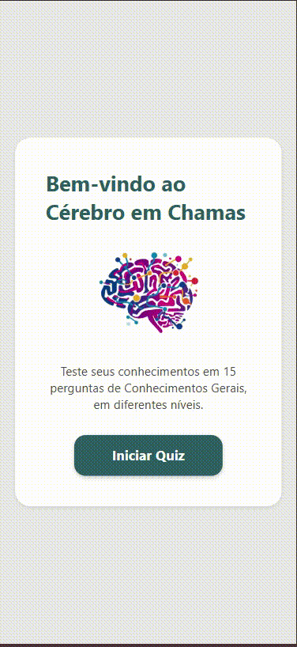

# 🏆 Quiz App - Sarah Dias Venancio  
**Status do Projeto:** Concluído ✔️   

---

## 📑 Tabela de Conteúdos  
- [Descrição do Projeto](#-descrição-do-projeto)  
- [Demonstração da Aplicação](#-demonstração-da-aplicação)  
- [Funcionalidades](#-funcionalidades)  
- [Tecnologias Utilizadas](#️-tecnologias-utilizadas)  
- [Como Rodar o Projeto Localmente](#️-como-rodar-o-projeto-localmente)  
- [Autora](#-autora)  

---

## 📖 Descrição do Projeto  
<p align="start">
Este projeto é um aplicativo de <b>quiz multiplataforma</b>, desenvolvido com <b>React Native</b> e <b>Expo</b>, como projeto final do curso de programação.  
O aplicativo apresenta um questionário com feedback instantâneo, tela de resultados e a possibilidade de jogar novamente.
</p>  

---

## 🎥 Demonstração da Aplicação  
<p align="center">
  
</p>  

---

## 🚀 Funcionalidades  
- **Quiz Interativo**: Fluxo de perguntas e respostas com validação.  
- **Feedback Visual**: Respostas são marcadas como corretas ou incorretas instantaneamente.  
- **Placar**: Pontuação é calculada e atualizada a cada rodada.  
- **Tela de Resultados**: Exibe a pontuação final ao término do quiz.  
- **Jogar Novamente**: Usuário pode reiniciar o quiz.  
- **Funcionalidade Adicional**: Cronômetro e Ranking de Jogadores.  

---

## 🛠️ Tecnologias Utilizadas  
  
  
  

📦 [@react-native-async-storage/async-storage](https://github.com/react-native-async-storage/async-storage) para salvar o ranking localmente.  

---

## ⚙️ Como Rodar o Projeto Localmente  

```bash
# 1. Clone o repositório
$ git clone [link-do-seu-repositorio]

# 2. Navegue até o diretório do projeto
$ cd quiz-app

# 3. Instale as dependências
$ npm install

# 4. Inicie o servidor de desenvolvimento
$ npm start
```
Após executar `npm start`, pressione `w` para abrir no navegador ou escaneie o QR Code com o app Expo Go no seu celular.

---

## ✨ Funcionalidades Adicionais: Temporizador, Ranking e Níveis

Esta seção detalha as funcionalidades extras implementadas como parte do desafio final do curso.

---
### 📌 Descrição  
As novas funcionalidades tornam o quiz mais dinâmico e desafiador. O **temporizador** limita o tempo de resposta de cada pergunta a 15 segundos, adicionando ritmo ao jogo e evitando que o jogador demore demais em uma questão, além de vibrar quando ele não responde.  
Também foi implementado um **ranking local**, que armazena os resultados no dispositivo e exibe os **3 melhores jogadores em cada nível de dificuldade**. Para aumentar a rejogabilidade, o quiz conta com **três níveis de dificuldade (Fácil, Médio e Difícil)**, permitindo que o usuário escolha a intensidade do desafio antes de começar.  

---

### ⚡ Desafios e Aprendizados  
O maior desafio foi implementar os **níveis de dificuldade**, pois exigiu alterações na estrutura do arquivo `JSON` de perguntas e ajustes na lógica de seleção dentro do app. Também foi necessário estudar e aplicar o **AsyncStorage** para salvar e recuperar os dados do ranking de forma assíncrona.  

Outro aprendizado importante foi o uso de **useEffect** para controlar o ciclo de vida do **temporizador**, garantindo que o contador reinicie corretamente a cada pergunta e seja limpo para evitar vazamento de memória. Esses pontos trouxeram uma experiência prática em **gerenciamento de estado**, **persistência de dados** e **boas práticas de otimização em React Native**.  

### Demonstração da Nova Funcionalidade
<p align="center">
  
</p>

---

### 👨‍💻 Autora
[<br><sub>Sarah Dias Venâncio</sub>](https://github.com/SarahVenancio) 

Sob a orientação do **Prof. Rafael Ribas**.